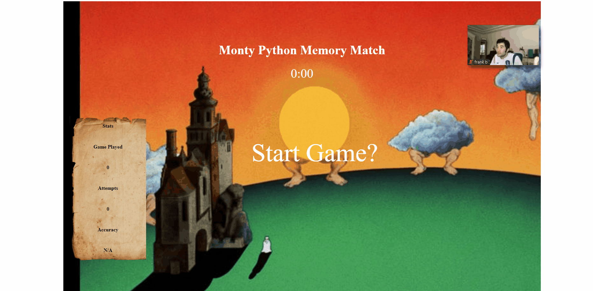

# Monty Python and the Quest to Match
[live-deployment](memory-match.davidlyu.com)

## Description
This app is a memory-match game with 9 specific cards that the user has to match.
Sample Image below:

## Technologies Used:
* JavaScript
* HTML5
* CSS3

## Getting Started

1. Clone the repository

    git clone https://github.com/david-lyu/memory-match
    cd memory-match
